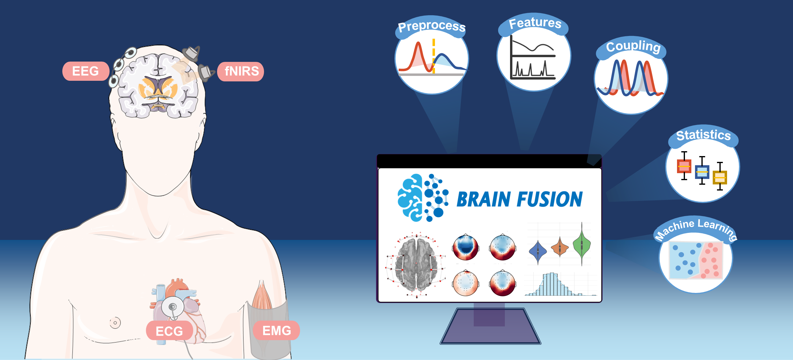

# BrainFusion
**BrainFusion** is an open-source, Python-based platform developed by the Medical Information and Neuroimaging Laboratory (MINILab) at the School of Biomedical Science and Engineering, South China University of Technology (SCUT), which designed to streamline the exploration of brain-body interactions and multimodal Brain-Computer Interfaces (BCI). This platform addresses the growing need for tools that integrate and analyze signals such as EEG, EMG, ECG, and fNIRS in neuroscience and BCI research.
## Key Features
- **User-Friendly Interface**: Offers a standardized solution for multimodal signal analysis, reducing the need for advanced programming skills.
- **Multimodal Signal Support:** Preprocessing pipelines for EEG, EMG, ECG, and fNIRS.
- **Feature Extraction:** Time-domain, frequency-domain, time-frequency domain, and complex network theory features.
- **Coupling Analysis:** Neurovascular coupling, corticomuscular coherence, and brain-heart interaction pipelines.
- **Comprehensive Visualization Tools**: Facilitates visualization of statistical and machine learning results, enhancing the depth of analysis.
- **Adaptable and Extensible**: Supports standardized data formatting and enables custom workflow development.



## Why BrainFusion?

The integration of multimodal physiological signals is increasingly vital in neuroscience and BCI research. However, the absence of dedicated tools often forces researchers to rely on complex programming, limiting accessibility. **BrainFusion** bridges this gap, empowering:
- Experienced researchers
- Clinicians
- Early-career neuroscientists
- Students

By lowering the barriers to multimodal analysis, BrainFusion fosters an open and collaborative ecosystem, making studies of brain-body interaction and multimodal BCI accessible to a broader audience.

## Installation

1. Clone the repository:
```bash
git clone https://github.com/YourUsername/BrainFusion.git  
cd BrainFusion
```
2. Install dependencies:
```bash
pip install -r requirements.txt  
```
3. Launch BrainFusion:
```bash
python brainfusion.py  
```
## Documentation
Comprehensive documentation, including tutorials and API references, is available [here](https://github.com/lwh-scut/BrainFusion).

## Contribution
Contributions are welcome! Please fork the repository and submit a pull request or raise an issue for discussion.

## License
This project is licensed under the BSD 3-Clause License. See the LICENSE file for details.
