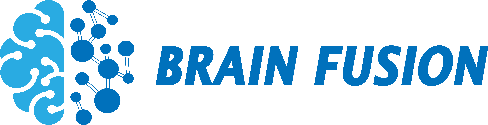

# BrainFusion
**BrainFusion** is an open-source, Python-based platform developed by the Medical Information and Neuroimaging Laboratory (MINILab) at the School of Biomedical Science and Engineering, South China University of Technology (SCUT), which designed to streamline the exploration of brain-body interactions and multimodal Brain-Computer Interfaces (BCI). This platform addresses the growing need for tools that integrate and analyze signals such as EEG, EMG, ECG, and fNIRS in neuroscience and BCI research.

## Key Features
- **User-Friendly Interface**: Offers a standardized solution for multimodal signal analysis, reducing the need for advanced programming skills.
- **Multimodal Signal Support:** Preprocessing pipelines for EEG, EMG, ECG, and fNIRS.
- **Feature Extraction:** Time-domain, frequency-domain, time-frequency domain, and complex network theory features.
- **Coupling Analysis:** Neurovascular coupling, corticomuscular coherence, and brain-heart interaction pipelines.
- **Comprehensive Visualization Tools**: Facilitates visualization of statistical and machine learning results, enhancing the depth of analysis.
- **Adaptable and Extensible**: Supports standardized data formatting and enables custom workflow development.


## Why BrainFusion?

The integration of multimodal physiological signals is increasingly vital in neuroscience and BCI research. However, the absence of dedicated tools often forces researchers to rely on complex programming, limiting accessibility. **BrainFusion** bridges this gap, empowering:
- Experienced researchers
- Clinicians
- Early-career neuroscientists
- Students

By lowering the barriers to multimodal analysis, BrainFusion fosters an open and collaborative ecosystem, making studies of brain-body interaction and multimodal BCI accessible to a broader audience.

## Update Plan

|  Version   | Release Target  |                         Key Features                         |      Technical Focus       |
| :--------: | :-------------: | :----------------------------------------------------------: | :------------------------: |
| **v0.1.0** |    Released     | • EEG/fNIRS/ECG/EMG preprocessing • Feature extraction pipelines • Statistical analysis tools • Machine learning models • Neurovascular coupling | Core framework development |
| **v0.1.1** |  June 30, 2025  | • Visual workflow editor • Drag-and-drop pipeline builder • Custom workflow templates • Plugin system architecture |    UI/UX modernization     |
| **v0.1.2** |  July 30, 2025  | • AutoML model optimization • Deep learning baseline models  |  AI framework integration  |
| **v0.1.3** | August 30, 2025 | • Standalone app generator • Visual interface templating • One-click deployment |    Distribution system     |

### preview

v0.1.1 Add drag-and-drop interface for customized workflow


## Installation

### 1.Python Environment (For Developers)

**Clone the repository:**

```bash
git clone https://github.com/lwh-scut/BrainFusion.git  
cd BrainFusion/src
```
**Install dependencies:**

```bash
pip install -r requirements.txt  
```
**Launch BrainFusion:**

```bash
python main.py  
```
### 2. Standalone Packages (For End Users)

| Platform    | Files                                                        | Version | Description                                                  |
| ----------- | ------------------------------------------------------------ | ------- | ------------------------------------------------------------ |
| **Windows** | [brainfusion v0.1.0-pre-release](./application/brainfusion-v0.1.0-pre-release/) | 0.1.0   | Versions of functions and basic UI that implement EEG, fNIRS, ECG, EMG preprocessing, feature extraction, statistical analysis, machine learning, and coupling computation |

## Contribution & Contact
Contributions are welcome! Please fork the repository and submit a pull request or raise an issue for discussion. We also provide personalized assistance for all users and respond to research inquiries within 48 hours. (E-mail: brainfusion@163.com)

## License
This project is licensed under the BSD 3-Clause License. See the LICENSE file for details.
